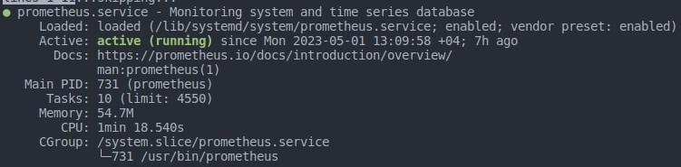
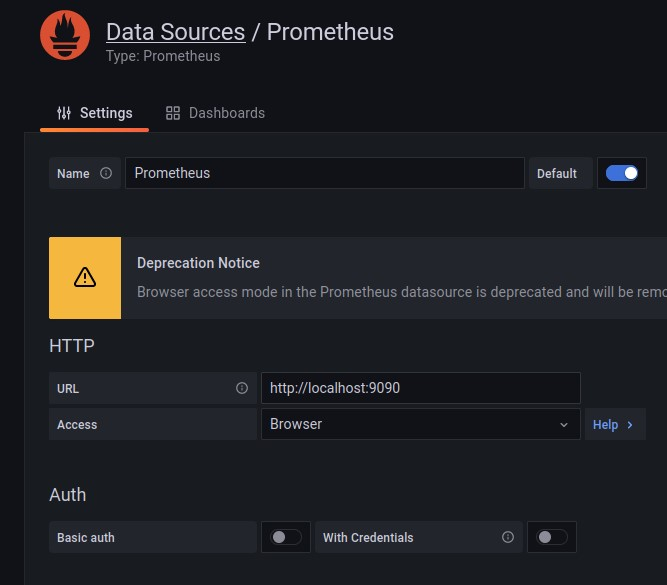
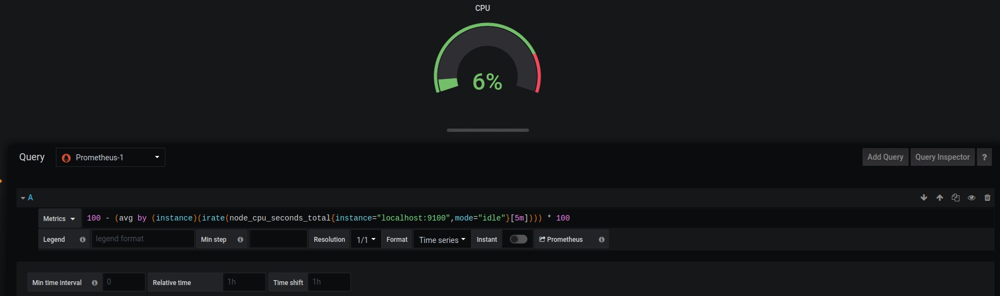
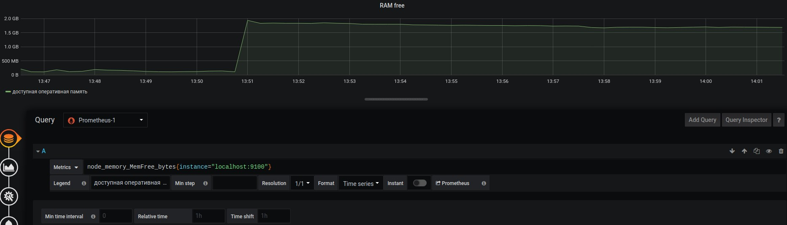
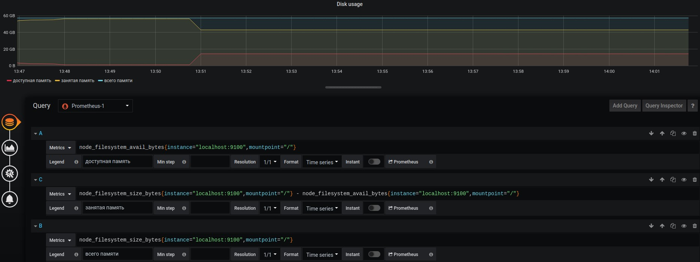
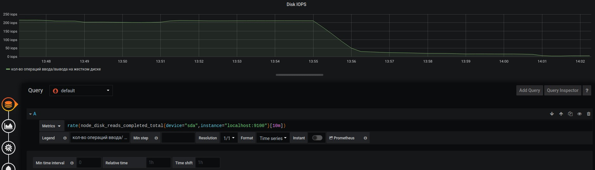
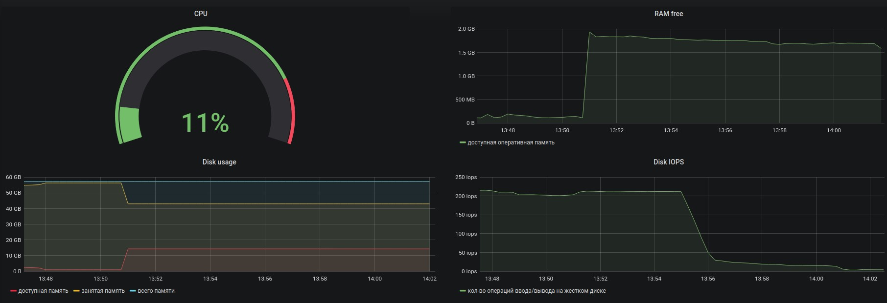
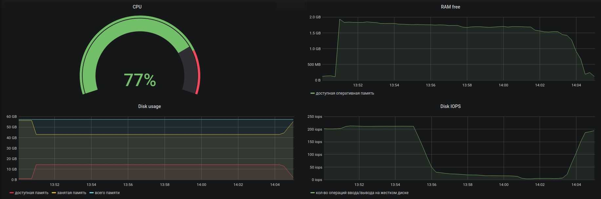
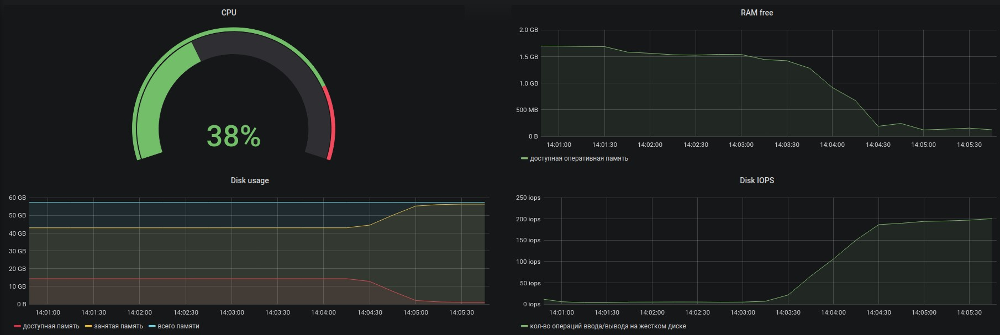
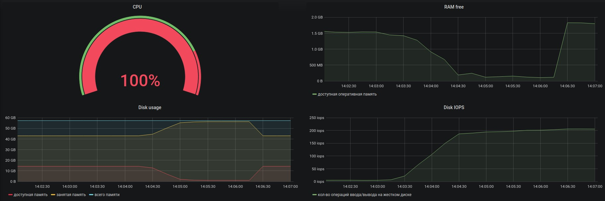

## Содержание

- [Содержание](#содержание)
- [1. Установка Prometheus ](#1-установка-prometheus-)
- [2. Установка Grafana ](#2-установка-grafana-)
- [3. Настройка Grafana ](#3-настройка-grafana-)
- [4. Создание собственных dashboards](#4-создание-собственных-dashboards)
- [5. Тест созданных dashboards](#5-тест-созданных-dashboards)

## 1. Установка Prometheus <br/>

* Для установки `Prometheus` выполним команду <br/>
    ```sh
    $ sudo apt install prometheus
    ```
* Запустим `Prometheus` <br/>
    ```sh
    $ sudo systemctl start prometheus
    ```
* Убедимся, что `Prometheus` запустился <br/>
    ```sh
    $ sudo systemctl status prometheus
    ```
    <br/>

## 2. Установка Grafana <br/>

* Установим компоненты для работы `Grafana` <br/>
    ```sh
    $ sudo apt install apt-transport-https
    $ sudo apt install software-properties-common
    ```
* Добавим ключ репозитория в систему <br/>
    ```sh
    $ sudo wget -q -O /usr/share/keyrings/grafana.key https://apt.grafana.com/gpg.key
    ```
* Добавим репозиторий <br/>
    ```sh
    $ echo "deb [signed-by=/usr/share/keyrings/grafana.key] https://apt.grafana.com stable main" | sudo tee -a /etc/apt/sources.list.d/grafana.list
    ```
* Обновим список пакетов <br/>
    ```sh
    $ sudo apt update
    ```
* Установим `Grafana` <br/>
    ```sh
    $ sudo apt install grafana
    $ sudo apt install grafana-enterprise
    ```
* Добавим в автоматический запуск <br/>
    ```sh
    $ sudo /bin/systemctl daemon-reload
    $ sudo /bin/systemctl enable grafana-server
    $ sudo /bin/systemctl start grafana-server
    ```

## 3. Настройка Grafana <br/>

* В браузере перейдем по адресу `http://localhost:3000/` <br/>
    <br/>
* При первом запуске вводим логин: `admin` и пароль: `admin`. После этого будет предложено заменить пароль<br/>
* После этого перейдем `Configuration->Data Source` и нажимаем кнопку `Add Data Source`<br/>
* В открывшемся окне выбираем тип Data Source - `Prometheus`<br/>
* В поле URL вводим адрес сервера, на котором доступен Prometheus и его порт. Так как Grafana находится на той же машине, что и Prometheus, используем `localhost`, а порт по умолчанию `9090`<br/>
    <br/>
* Сохраняем изменения `Save and Test`<br/>

## 4. Создание собственных dashboards

* Для создание dashboard нажимаем `Add panel->Add new panel`<br/>
* Создадим панель для отображения `CPU`<br/>
    <br/>
* Создaдим панель для отображения `доступной оперативной памяти`<br/>
    <br/>
* Создадим панель для отображения объема `всей памяти`, `занятой памяти` и `свободной памяти`<br/>
    <br/>
* Создадим панель для отображения `количества операций ввода/вывода на жестком диске`<br/>
    <br/>
* Конечный результат
    <br/>

## 5. Тест созданных dashboards

* Запустим bash-скрипт из `Part 2`<br/>
* Проверим результаты работы
    <br/>
    <br/>
* Установим утилиту `stress`
    ```sh
    $ sudo apt install stress
    ```
* Запустим команду
    ```sh
    $ stress -c 2 -i 1 -m 1 --vm-bytes 32M -t 60s
    ```
* Проверим результаты работы
    <br/>
