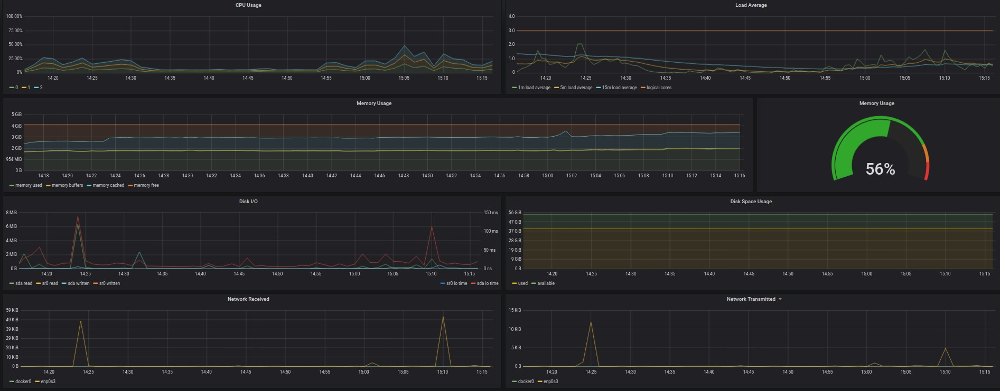
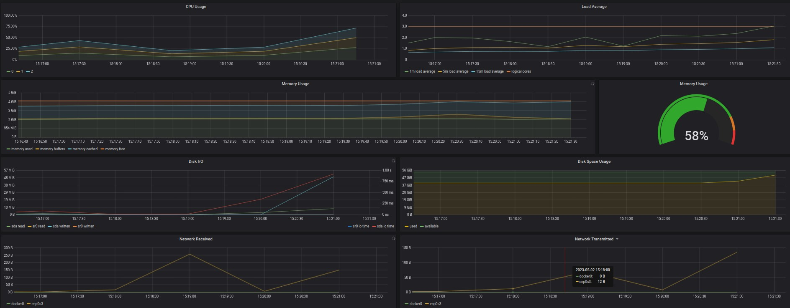
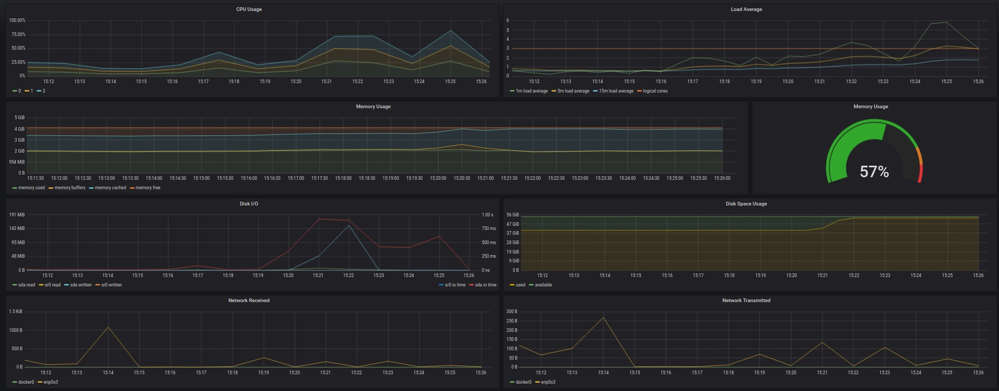
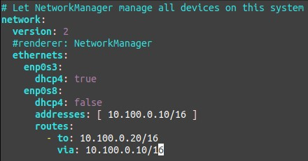
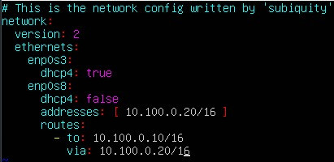
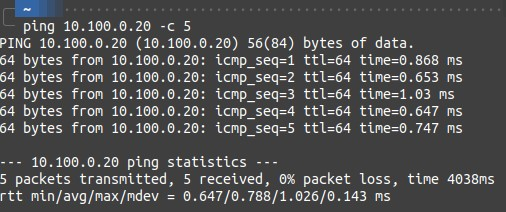
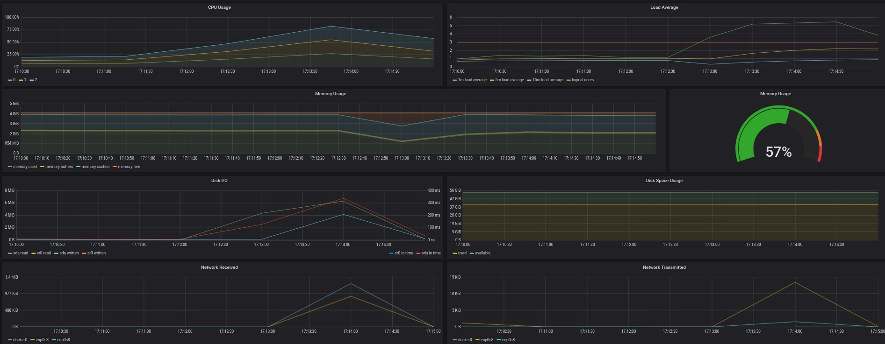

## Содержание

- [Содержание](#содержание)
- [1. Установка готового dashboard ](#1-установка-готового-dashboard-)
- [2. Тесты добавленного dashboard ](#2-тесты-добавленного-dashboard-)
- [3. Настройка статической маршрутизации между двумя машинами ](#3-настройка-статической-маршрутизации-между-двумя-машинами-)
- [4. Тест нагрузки сети ](#4-тест-нагрузки-сети-)

## 1. Установка готового dashboard <br/>

* Установим готовый дашборд `Node Exporter Quickstart and Dashboard` с официального сайта Grafana Labs https://grafana.com/grafana/dashboards/13978-node-exporter-quickstart-and-dashboard/ <br/>
* Добавим дашборд в Grafana: `Dashboards->Manage->Import` и загружаем скачанный .json файл <br/>
    <br/>

## 2. Тесты добавленного dashboard <br/>

* Запустим bash-скрипт из `Part 2`<br/>
* Проверим результаты работы
    <br/>
* Запустим команду
    ```sh
    $ stress -c 2 -i 1 -m 1 --vm-bytes 32M -t 60s
    ```
* Проверим результаты работы
    <br/>

## 3. Настройка статической маршрутизации между двумя машинами <br/>

* Опишем сетевой интерфейс первой машины <br/>
    <br/>
* Опишем сетевой интерфейс второй машины <br/>
    <br/>
* Применим изменения <br/>
    ```sh
    $ sudo neplan apply
    ```
* Проверим, что машины пингуются <br/>
    <br/>

## 4. Тест нагрузки сети <br/>

* Первая машина выступает в роли сервера, выполним команду <br/>
    ```sh
    $ iperf3 -s
    ```
* Вторая машина выступает в роли клиента, выполним команду <br/>
    ```sh
    $ iperf3 -c 10.100.0.10
    ```
* Посмотрим на нагрузку сетевого интерфейса <br/>
    <br/>